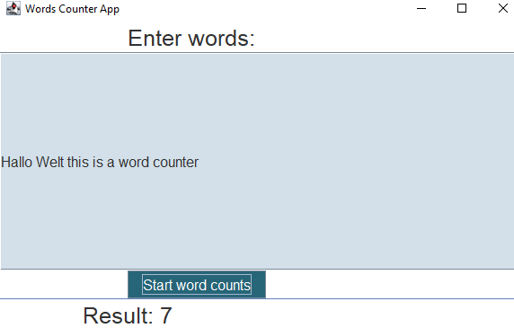
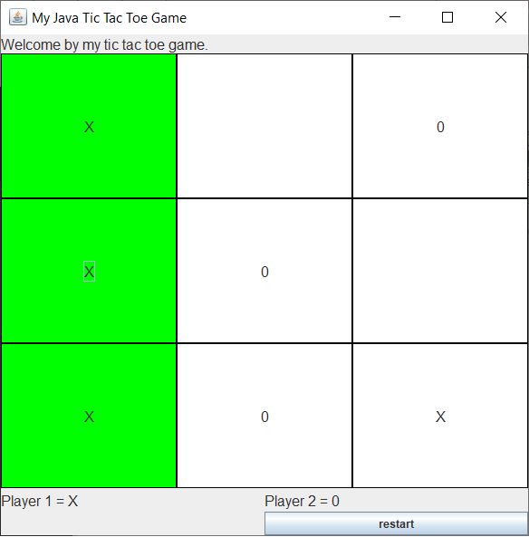
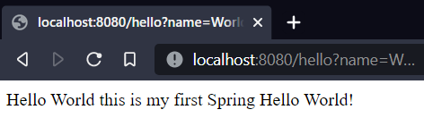

# Learn_Java
A repository that I use to learn Java.

## Overview

- [Overview](#overview)
  - [Goals](#goals)
  - [Projects](#projects)
  - [Screenshot](#screenshot)
  - [Resources](#resources)

- [Author](#author)

### Goals
I revised this repository at the end of 2021 and will now expand it regularly.

- Java
- Swing, AWT, JavaFX
- JUnit
- Maven, Gradle
- Spring, Spark

### Projects

- Basics - small console projects
- Learn_GUI - work with GUI
- ToDoList - Java, Swing
- Reaction Time Tester - Java, Swing
- WordCounter - Java, Swing
- Tic Tac Toe - Java, Swing
- Spring Hello World - the Spring Quickstart Guide
- Spark - first spark framework project

### Screenshot
ToDoList:  
  

Reaction Time Tester:  
  

WordCounter:  
  

TicTacToe:  
  

Spring Hello World:  
  

### Resources

- Java 1.8 or higher
- Gradle (with Java 1.8, because gradle doesn't support java 18 yet 2022-09)

I'm just trying to use my own pictures and icons.

- Images: my personal pictures
- Icons: my personal icons

## Author

- Website - [Martin Klestil](https://github.com/mklestil)
- Twitter - [@mklestil](https://twitter.com/MKlestil)
- Linkedin - [@mklestil](https://www.linkedin.com/in/martin-klestil/)

