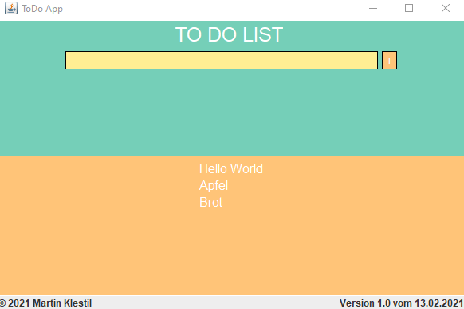
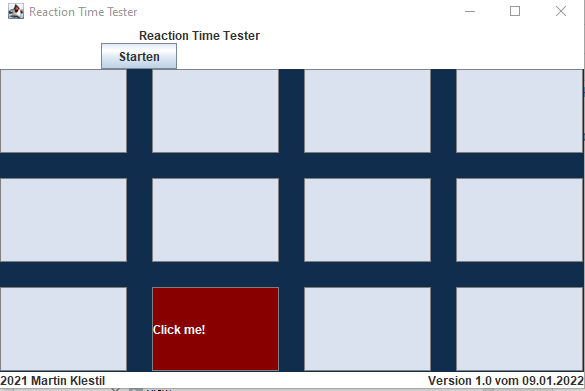

# Learn_Java
A repository that I use to learn Java.

## Overview

- [Overview](#overview)
  - [Goals](#goals)
  - [Projects](#projects)
  - [Screenshot](#screenshot)
  - [Resources](#resources)

- [Author](#author)

### Goals
I revised this repository at the end of 2021 and will now expand it regularly.

- Java
- Swing, AWT
- JUnit
- Maven
- Gradle
- Spring

### Projects

- ToDoList - Java, Swing
- Reaction Time Tester - Java, Swing

### Screenshot
ToDoList:

Reaction Time Tester:

### Resources
I'm just trying to use my own pictures and icons.

- Images: my personal pictures
- Icons: my personal icons

## Author

- Website - [Martin Klestil](https://github.com/mklestil)
- Twitter - [@mklestil](https://twitter.com/MKlestil)
- Linkedin - [@mklestil](https://www.linkedin.com/in/martin-klestil/)

