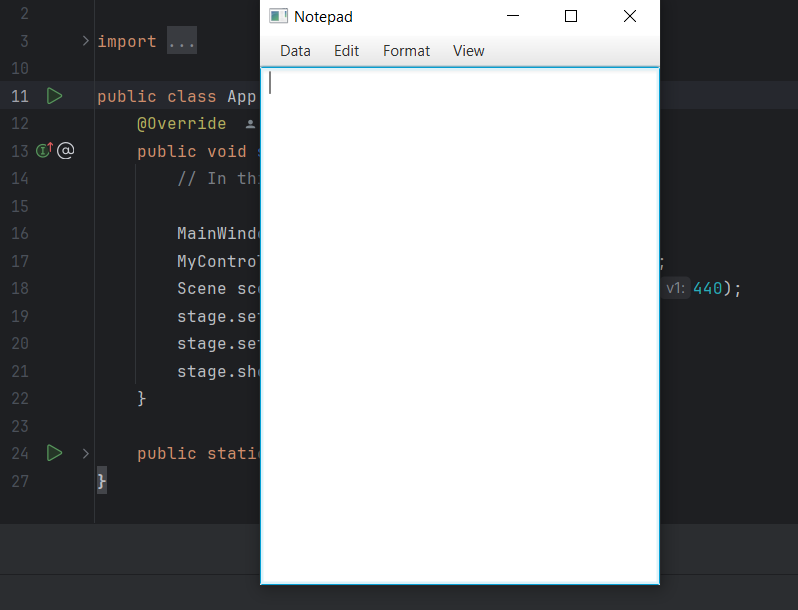
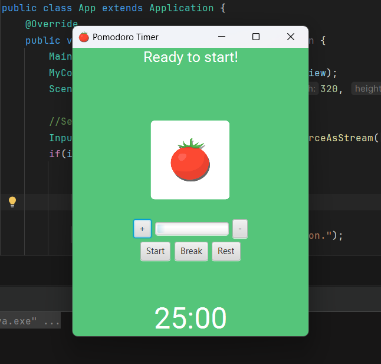
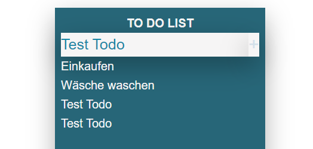

# Learn_Java
A repository that I use to learn Java.

## Overview

- [Overview](#overview)
  - [Goals](#goals)
  - [Projects](#projects)
  - [Screenshot](#screenshot)
  - [Resources](#resources)

- [Author](#author)

### Goals
With this repository I would like to improve my Java skills. I'm learning with the Java Roadmap from roadmap.sh and trying to implement my own projects on the topics.

Here are some technologies I have worked with:
- Java
  - Serialization
  - Networking & Sockets
  - Streams
- Swing, AWT, JavaFX
- JUnit
- Build Tools, Maven, Gradle
- Web, Spring, Spark

### Projects

- Basics - small console projects
- Learn_GUI - work with GUI
- ToDoList - Java, Swing
- Reaction Time Tester - Java, Swing
- WordCounter - Java, Swing
- Tic Tac Toe - Java, Swing
- Calculator - Java, JavaFX
- Dock - Java, JavaFX
- Notepad - Java, JavaFX
- Pomodoro Timer - Java, JavaFX
- Spring Hello World - the Spring Quickstart Guide
- Spring TodoList - my first TodoList in Spring
- Spark - first spark framework project

### Screenshot
ToDoList:  
  

Reaction Time Tester:  
  

WordCounter:  
  

TicTacToe:  
  

JavaFX Calculator:  
  

JavaFX Dock:
  

JavaFX Notepad:
  

JavaFX PomodoroTimer:
  

Spring Hello World:  
  

Spring ToDoList:
  

### Resources

- Java 1.8 or higher
- Gradle, Maven
- JUnit
- Spring, Spring Boot 

I'm just trying to use my own pictures and icons.

- Images: my personal pictures
- Icons: my personal icons

## Author TintilDev
- Website - [TintilDev](https://github.com/tintildev)
- Frontend Mentor - [Tintildev](https://www.frontendmentor.io/profile/tintildev)
- Bluesky - [@tintildev‬](https://bsky.app/profile/tintildev.bsky.social)
- LinkedIn - [Martin Klestil](https://www.linkedin.com/in/martin-klestil/)
- Dev.to [TintilDev](https://dev.to/tintildev)

